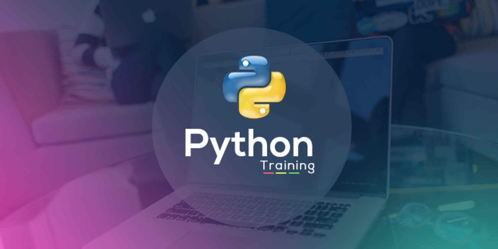

<div align="center">



# 🐍 Python Course – Final Year Students

### _Noor e Hamza Islamic College_

</div>

---

## 📘 About This Repository

Welcome to the official GitHub repository for the **Python Programming Course** designed for the final-year students of **Noor e Hamza Islamic College**.

This repo is packed with:

- 📓 **Class Notes** (clear, simple, and practical)
- 🧠 **Practice Code** (hands-on Python exercises)
- 💡 **Real-World Examples** (so you're not just coding in theory)

Whether you're just getting started or brushing up before graduation, this is your hub for learning Python the right way.

---

## 📂 Folder Structure

📁 This Repository/
├── 🧾 Notes and Scripts (.ipynb, .py files)
├── 🖼️ pic.jpg
└── 📄 README.md

---

## 🧑‍🏫 What You’ll Learn

✅ Python Basics (Variables, Conditions, Loops)  
✅ Functions and Modules  
✅ File Handling  
✅ Working with CSV, JSON, and PDFs  
✅ Mini Projects for Real Practice  
✅ Problem-solving & Logic Building Skills

> ⚡ No boring lectures — only real, practical programming.

---

## 🌱 For Students

- Want to clone this repo?

```bash
git clone https://github.com/KabirKhan1512/Python_NHIC.git
```
